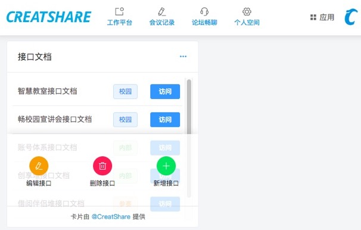

# 创享堆-微前端理念下的一站式运营平台

## 开发过程

```
vue create worker-space
cnpm i -S vue element axios
cnpm i -D vue-router mockjs express
```

## 本地开发

```
cnpm i
cnpm serve
```

## 项目页面

|页面名称|英文代号|进度状态|
|----|----|----|
|工作平台|working-desk|正在开发|
|会议记录|meeting-record|等待引入|
|论坛畅聊|forum-chatting|等待引入|
|权限管理|role-authority|等待引入|
|个人空间|personal-space|等待引入|

## 工作卡片

> 有很多可以实现的工作卡片，这里随时更新可以引入的

|卡片名称|英文代号|所占格子|进度状态|优先级|
|----|----|----|----|----|
|团队成员卡片|org-struct-card|1*1|正在开发|5|
|个人资料卡片|self-info-card|1*1|界面雏形|5|
|卡片管理卡片|card-manage-card|1*1|界面雏形|5|
|权限管理卡片|auth-manage-card|1*1|界面雏形|5|
|接口文档卡片|api-doc-card|1*1|界面雏形|4|
|考勤系统卡片|attend-system-card|1*1|界面雏形|4|
|会议记录卡片|-|-|等待引入|-|
|操作日志卡片|-|-|等待引入|-|
|纳新系统卡片|-|-|等待引入|-|
|论坛畅聊卡片|-|-|等待引入|-|
|技术博客卡片|-|-|等待引入|-|
|公号文章卡片|-|-|等待引入|-|
|周会分享卡片|-|-|等待引入|-|

### 卡片的意义与用途？

* 用卡片快速实现需求 Demo，加速业务进度，提高开发者生产力
* 每个卡片很小的空间，助于开发者关注技术需求，不过度依赖产品原型图
* 可自定义显示主页的卡片，每个卡片托管于卡片 Store，集中关注自己的需求
* 可探索结合的领域有微服务、敏捷开发、持续集成、持续部署、前端测试领域等

### 为什么说每个卡片是微前端的？

* 卡片是可以看作每个系统的小型版，可以独立开发、集成部署

### 卡片的独立开发与集成部署？

* 独立开发：意味着每个卡片是一个独立的项目仓库
* 现阶段集成部署：依然是单体架构，但利用微前端理念低耦合的开发每一个卡片
* 未来预期集成部署：可以通过包管理器将每一个卡片安装到母体架构下，或直接打包部署到线上

### 目前的困惑？

* 微前端和模块化编程的异同尚未明确理清
  * 模块化是单体架构下的"微"
  * 微前端是业务上的"微"
* 独立部署时，卡片项目依赖的模块如何安装到母体架构下并去重

## 更多功能

|功能概述|开发进度|
|----|----|
|登录功能|尚未开发|
|卡片 Store|尚未开发|
|卡片自定义分类|尚未开发|
|导航条动态按权限拉取|尚未开发|
|自定义背景图|尚未开发|

## Demo 预览



## 开源协议

暂不开源，请自觉维护知识产权。